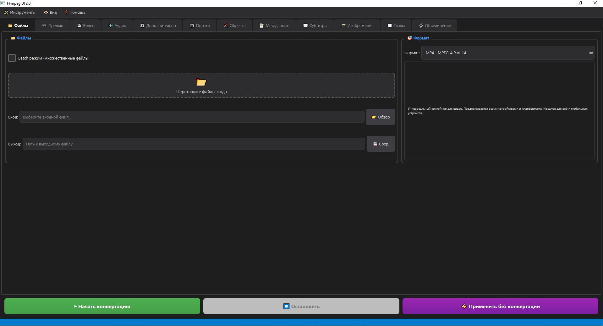
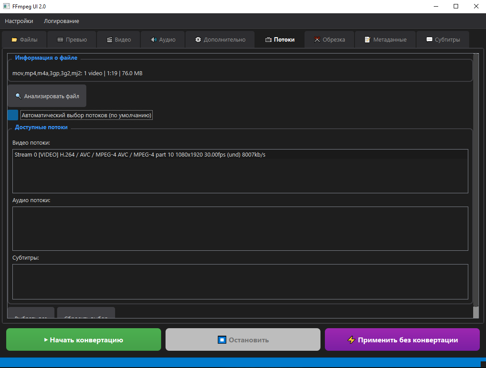
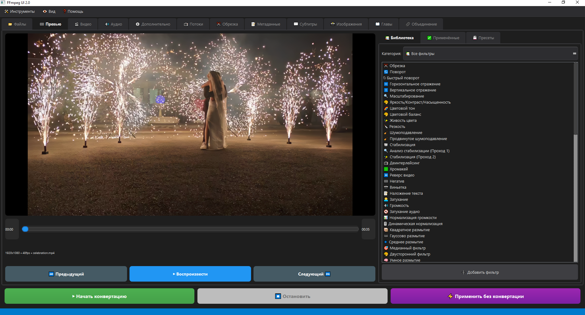

<div align="center">

# 🎬 FFmpeg UI 2.0

**Современное десктопное приложение для конвертации видео с GPU-ускорением**

[](https://www.python.org/)
[](https://doc.qt.io/qtforpython/)
[](https://ffmpeg.org/)
[](LICENSE)

[Возможности](#-возможности) • [Установка](#-установка) • [Использование](#-использование) • [Сборка](#-сборка-из-исходного-кода) • [Скриншоты](#-скриншоты)

</div>

---

## 📖 Обзор

FFmpeg UI 2.0 — это мощное и удобное десктопное приложение, предоставляющее современный графический интерфейс для конвертации видео через FFmpeg. Построено на PySide6 (Qt6) и предлагает интеллектуальный выбор кодеков, аппаратное GPU-ускорение, предпросмотр в реальном времени, пакетную обработку и расширенные возможности фильтрации.

### ✨ Ключевые особенности

- 🚀 **GPU-ускорение** - Автоматическое обнаружение и валидация кодировщиков NVIDIA NVENC, Intel QSV, AMD AMF и VAAPI
- 🎯 **Умный выбор кодеков** - Интеллектуальные рекомендации на основе контейнера, назначения и поддержки оборудования
- 🎨 **Предпросмотр видео** - Превью с применением фильтров в реальном времени через OpenCV
- ⚡ **Пакетная обработка** - Конвертация нескольких файлов последовательно с детальным отслеживанием прогресса
- 🎛️ **Расширенные фильтры** - 40+ встроенных видео и аудио фильтров с управлением пресетами
- 📺 **Выбор потоков** - Выбор конкретных видео/аудио/субтитров из многопоточных файлов
- ⏱️ **Точная обрезка** - Обрезка и нарезка видео с точностью до кадра
- 🎬 **Работа с главами** - Просмотр и редактирование глав в видеофайлах
- 🖼️ **Секвенции изображений** - Создание видео из последовательности изображений
- ➕ **Склейка видео** - Объединение нескольких видеофайлов в один
- 💬 **Субтитры** - Вшивание и работа с внешними субтитрами
- 📝 **Редактор метаданных** - Полный контроль над метаданными файлов
- 🌓 **Современный интерфейс** - Чистый, отзывчивый UI с автоматическим определением темной/светлой темы

---

## 🎯 Возможности

<table>
<tr>
<td width="50%">

### Обработка видео
- Кодирование H.264, H.265, VP9, AV1
- Аппаратное GPU-ускорение (NVENC, QSV, AMF, VAAPI)
- Контроль качества через CRF и bitrate
- Масштабирование разрешения и настройка FPS
- Двухпроходное кодирование для оптимального качества

</td>
<td width="50%">

### Обработка аудио
- Кодирование AAC, Opus, Vorbis, MP3
- Контроль битрейта и частоты дискретизации
- Поддержка многоканального аудио
- Фильтры нормализации звука
- Эффекты громкости и затухания

</td>
</tr>
<tr>
<td width="50%">

### Продвинутые функции
- **Система фильтров**: 40+ видео/аудио фильтров с live preview
  - Базовые: поворот, масштабирование, обрезка, отражение
  - Цветокоррекция: яркость, контраст, насыщенность, гамма, LUT 3D
  - Эффекты: размытие, резкость, шумоподавление, деинтерлейс
  - Стабилизация: vidstab, deshake
  - Хромакей: удаление зеленого/синего фона
  - Временные: интерполяция кадров, реверс, fade
  - Аудио: компрессор, эквалайзер, нормализация, chorus, стерео
- **Выбор потоков**: Выбор конкретных дорожек из файлов
- **Работа с главами**: Просмотр и редактирование глав видео
- **Секвенции изображений**: Создание видео из PNG/JPG последовательностей
- **Склейка видео**: Concatenation с автоматическим созданием файла списка
- **Редактор метаданных**: Редактирование тегов и метаданных файла
- **Поддержка субтитров**: Вшивание или копирование субтитров (SRT, ASS, SSA)
- **Контроль времени**: Точная обрезка через `-ss`, `-t`, `-to`
- **Двухпроходное кодирование**: Оптимальное качество при целевом битрейте

</td>
<td width="50%">

### Пользовательский опыт
- **Очередь пакетной обработки**: Автоматическая обработка файлов
- **Прогресс в реальном времени**: Индикатор с ETA и скоростью
- **Валидация GPU**: Тестирование кодировщиков при запуске
- **Система логирования**: Детальные логи с просмотром в реальном времени
- **Портативная сборка**: Один `.exe` файл без установки

</td>
</tr>
</table>

---

## 📦 Установка

### Вариант 1: Скачать портативный исполняемый файл (Рекомендуется)

1. Скачайте `FFmpegUI.exe` из раздела [Releases](../../releases)
2. Запустите файл — установка не требуется
3. Первый запуск занимает 10-15 секунд (распаковка), последующие ~2-3 секунды

> **Примечание**: Windows может показать предупреждение SmartScreen. Нажмите "Подробнее" → "Выполнить в любом случае". Это нормально для неподписанных приложений.

### Вариант 2: Запуск из исходного кода

```bash
# Клонировать репозиторий
git clone https://github.com/JB-SelfCompany/FFmpeg-UI-2.0.git
cd FFmpeg-UI-2.0

# Установить зависимости
pip install -r requirements.txt

# Запустить приложение
python app/main.py
```

**Требования:**
- Python 3.8+
- Windows 10/11 (для GPU функций)
- Visual C++ Redistributable ([Скачать](https://aka.ms/vs/17/release/vc_redist.x64.exe))

---

## 🚀 Использование

### 🎛️ Режимы работы

Приложение поддерживает два режима работы:

#### 🔰 Базовый режим
Идеален для начинающих пользователей. Показывает только 5 основных вкладок:
- 📁 Файлы
- 🎞 Превью
- 🎬 Видео
- 🔊 Аудио
- ⚙️ Дополнительно

#### 🔧 Расширенный режим
Для продвинутых пользователей. Дополнительно показывает 7 специализированных вкладок:
- 📺 Потоки
- ✂️ Обрезка
- 📝 Метаданные
- 💬 Субтитры
- 📸 Изображения
- 📖 Главы
- 🔗 Объединение

Переключение режимов: **Меню "Вид" → "Расширенный режим"**

---

### 📋 Детальное описание функций

#### 📁 Вкладка "Файлы"

**Назначение:** Выбор входных файлов и настройка вывода

**Функции:**
- **Добавление файлов:**
  - Кнопка "Выбрать файлы" - выбор одного или нескольких видеофайлов
  - Кнопка "Выбрать папку" - добавление всех видеофайлов из папки
  - Drag & Drop поддержка - перетащите файлы прямо в окно
  - Поддерживаемые форматы: MP4, MKV, AVI, MOV, WebM, FLV, WMV, TS, M2TS и другие

- **Пакетная обработка:**
  - Автоматическая конвертация нескольких файлов последовательно
  - Отображение списка файлов с возможностью удаления
  - Сохранение структуры папок (опционально)
  - Автоматическая генерация выходных имен файлов

- **Выбор формата вывода:**
  - MP4 (H.264/H.265/AV1) - универсальный формат
  - MKV (Matroska) - поддержка всех кодеков, множественных дорожек
  - WebM (VP8/VP9/AV1) - веб-оптимизированный формат
  - AVI - совместимость со старым оборудованием
  - MOV (QuickTime) - для Apple устройств

- **Выходная папка:**
  - Кнопка "Обзор" для выбора папки сохранения
  - Сохранение в исходную папку (опция)
  - Префикс/суффикс для выходных файлов

---

#### 🎞 Вкладка "Превью"

**Назначение:** Предпросмотр видео с живым применением фильтров

**Функции:**
- **Воспроизведение видео:**
  - Покадровая навигация с помощью слайдера
  - Кнопки управления: Play/Pause, Предыдущий/Следующий кадр
  - Автоматическая подстройка размера превью под окно
  - Отображение текущего времени и общей длительности

- **Live Filter Preview:**
  - Применение фильтров к текущему кадру в реальном времени
  - Мгновенное обновление при изменении параметров фильтров
  - Сравнение "до/после" (кнопка переключения)
  - Поддержка всех видео фильтров из библиотеки

- **Информация о видео:**
  - Разрешение (например, 1920x1080)
  - Частота кадров (FPS)
  - Продолжительность
  - Видеокодек
  - Битрейт

- **Технология:**
  - OpenCV для декодирования кадров
  - NumPy для обработки изображений
  - QImage/QPixmap для отображения

---

#### 🎬 Вкладка "Видео"

**Назначение:** Настройка параметров видеокодирования

**Функции:**
- **Выбор видео кодека:**
  - **Авто** - автоматический выбор на основе формата и цели
  - **H.264 (AVC)** - универсальная совместимость
  - **H.265 (HEVC)** - лучшее сжатие, меньший размер файла
  - **VP9** - открытый кодек для WebM
  - **AV1** - следующее поколение, максимальная эффективность
  - **VP8** - совместимость с WebM
  - **Копировать** - без перекодирования (stream copy)

- **Целевое назначение:**
  - **Универсальное** - баланс качества и размера
  - **Качество** - максимальное качество
  - **Размер** - минимальный размер файла
  - **Скорость** - быстрое кодирование
  - **Веб** - оптимизация для потокового воспроизведения
  - **Архив** - долгосрочное хранение

- **Контроль качества:**
  - **CRF (Constant Rate Factor):**
    - Диапазон: 0-51 (меньше = лучше качество)
    - Рекомендуемые значения: 18-28
    - Переменный битрейт на основе сложности сцены
  - **Битрейт (kbps/Mbps):**
    - Точный контроль размера файла
    - Поддержка CBR (постоянный) и ABR (средний)
    - Минимальный и максимальный битрейт

- **Разрешение:**
  - Оригинальное (без изменений)
  - Предустановки: 3840x2160 (4K), 2560x1440 (2K), 1920x1080 (Full HD), 1280x720 (HD), 854x480 (SD), 640x360
  - Пользовательское разрешение
  - Сохранение соотношения сторон

- **Частота кадров (FPS):**
  - Оригинальная
  - Стандартные: 24, 25, 30, 50, 60, 120
  - Пользовательская FPS

---

#### 🔊 Вкладка "Аудио"

**Назначение:** Настройка параметров аудиокодирования

**Функции:**
- **Выбор аудио кодека:**
  - **AAC** - универсальная совместимость, хорошее качество
  - **Opus** - лучшая эффективность, низкий битрейт
  - **MP3** - максимальная совместимость
  - **Vorbis** - открытый формат для OGG/WebM
  - **FLAC** - lossless сжатие
  - **AC3** - многоканальное аудио для домашнего кинотеатра
  - **Копировать** - без перекодирования

- **Битрейт аудио:**
  - Предустановки: 64, 96, 128, 192, 256, 320 kbps
  - Пользовательский битрейт
  - VBR (переменный битрейт) для Opus

- **Частота дискретизации:**
  - Оригинальная
  - Стандартные: 22050 Hz, 44100 Hz, 48000 Hz, 96000 Hz
  - Автоматический ресемплинг

- **Количество каналов:**
  - Моно (1 канал)
  - Стерео (2 канала)
  - 5.1 Surround (6 каналов)
  - 7.1 Surround (8 каналов)
  - Оригинальное количество

- **Дополнительные опции:**
  - Нормализация громкости
  - Удаление аудио полностью
  - Выбор конкретной аудиодорожки (для многодорожечных файлов)

---

#### ⚙️ Вкладка "Дополнительно"

**Назначение:** GPU-ускорение, пресеты, фильтры и продвинутые настройки

**Функции:**
- **GPU-ускорение:**
  - **NVIDIA NVENC:**
    - H.264 (h264_nvenc)
    - H.265 (hevc_nvenc)
    - AV1 (av1_nvenc) - для RTX 40 series
    - Пресеты: p1 (fastest) до p7 (slowest)
  - **Intel Quick Sync:**
    - H.264 (h264_qsv)
    - H.265 (hevc_qsv)
    - VP9 (vp9_qsv)
    - AV1 (av1_qsv) - для Arc GPU
  - **AMD AMF:**
    - H.264 (h264_amf)
    - H.265 (hevc_amf)
    - AV1 (av1_amf) - для RX 7000 series
  - **VAAPI** (Linux):
    - Аппаратное ускорение для Intel/AMD на Linux

- **Автоопределение GPU:**
  - Сканирование доступного оборудования при запуске
  - Тестирование кодировщиков на реальном encoding
  - Валидация поддержки кодека на выбранном GPU
  - Автоматический fallback на CPU при ошибках

- **Пресеты кодирования:**
  - **CPU (libx264/libx265):**
    - ultrafast, superfast, veryfast, faster, fast
    - medium (баланс)
    - slow, slower, veryslow (максимальное качество)
  - **NVENC:** p1-p7
  - **QSV:** veryfast, faster, fast, medium, slow, slower, veryslow
  - **AMF:** speed, balanced, quality

- **Двухпроходное кодирование:**
  - Checkbox включения 2-pass encoding
  - Первый проход: анализ видео, создание статистики
  - Второй проход: кодирование с оптимальным распределением битрейта
  - Автоматическая очистка временных файлов
  - Поддержка GPU-кодеров
  - Лучшее качество при целевом битрейте

- **Система фильтров:**
  - Библиотека из 40+ фильтров
  - Категории: трансформация, цвет, эффекты, аудио
  - Drag & Drop для изменения порядка
  - Enable/Disable переключатели
  - Редактирование параметров фильтров
  - Управление пресетами (сохранение/загрузка)
  - Экспорт/импорт пресетов в JSON

- **Дополнительные параметры FFmpeg:**
  - Поле для ручного ввода параметров
  - Экспертный режим для продвинутых пользователей
  - Примеры: `-tune film`, `-profile:v high`, `-level 4.1`

---

#### 📺 Вкладка "Потоки" (Расширенный режим)

**Назначение:** Выбор конкретных видео/аудио/субтитров дорожек из файла

**Функции:**
- **Анализ входного файла:**
  - Автоматическое сканирование через FFProbe
  - Отображение всех доступных потоков
  - Информация о каждом потоке: кодек, язык, битрейт, разрешение

- **Выбор видеопотоков:**
  - Список всех видеодорожек
  - Отображение параметров: разрешение, FPS, кодек
  - Выбор основной дорожки
  - Полезно для файлов с несколькими углами съемки

- **Выбор аудиопотоков:**
  - Список всех аудиодорожек
  - Информация: язык, кодек, каналы, битрейт
  - Множественный выбор для сохранения нескольких дорожек
  - Выбор дорожки по умолчанию

- **Выбор субтитров:**
  - Список встроенных субтитров
  - Язык и формат (SRT, ASS, SSA, PGS, VobSub)
  - Копирование или вшивание (burn-in)

- **Автоматический режим:**
  - Checkbox "Авто" - использовать все потоки
  - Ручной режим для точного контроля

- **Генерация -map параметров:**
  - Автоматическое создание FFmpeg -map команд
  - Поддержка сложных конфигураций

---

#### ✂️ Вкладка "Обрезка" (Расширенный режим)

**Назначение:** Точная обрезка и нарезка видео

**Функции:**
- **Начальная точка (Start Time):**
  - Ввод времени: HH:MM:SS или HH:MM:SS.mmm
  - Кнопка "Из превью" - установить из текущего кадра
  - FFmpeg параметр: `-ss`
  - Fast seek - применяется перед `-i` для быстрого поиска

- **Конечная точка:**
  - **Длительность (-t):**
    - Указать продолжительность вырезаемого фрагмента
    - Формат: секунды или HH:MM:SS
  - **Время окончания (-to):**
    - Абсолютное время окончания
    - Формат: HH:MM:SS
  - Переключатель между -t и -to

- **Дополнительные опции:**
  - **copyts** - сохранение оригинальных timestamp
  - **avoid_negative_ts** - коррекция отрицательных timestamp
  - **accurate_seek** - точный поиск (медленнее, но точнее)

- **Предпросмотр диапазона:**
  - Визуальный индикатор на timeline превью
  - Отображение начала и конца обрезки
  - Расчет итоговой длительности

- **Множественная нарезка:**
  - Возможность создания нескольких фрагментов (через пакетный режим)
  - Сохранение списка обрезок

---

#### 📝 Вкладка "Метаданные" (Расширенный режим)

**Назначение:** Редактирование метаданных файла

**Функции:**
- **Основные теги:**
  - **Title** - название видео
  - **Artist** / **Author** - автор/исполнитель
  - **Album** - альбом (для аудио)
  - **Date** / **Year** - дата создания
  - **Comment** - комментарий
  - **Description** - описание
  - **Genre** - жанр
  - **Track** - номер трека
  - **Copyright** - авторские права

- **Расширенные метаданные:**
  - **Composer** - композитор
  - **Performer** - исполнитель
  - **Publisher** - издатель
  - **Encoded_by** - кодировано
  - **Language** - язык
  - **Rating** - рейтинг

- **Копирование метаданных:**
  - Checkbox "Копировать из исходного" - сохранить все существующие метаданные
  - FFmpeg параметр: `-map_metadata 0`
  - Выборочное копирование отдельных тегов

- **Просмотр существующих метаданных:**
  - Кнопка "Показать текущие" - отображение всех метаданных файла
  - Загрузка через FFProbe
  - Автозаполнение полей

- **Генерация команды:**
  - Автоматическое создание `-metadata key=value` параметров
  - Экранирование специальных символов
  - Поддержка Unicode

---

#### 💬 Вкладка "Субтитры" (Расширенный режим)

**Назначение:** Работа с субтитрами

**Функции:**
- **Внешние субтитры:**
  - Кнопка "Выбрать файл субтитров"
  - Поддерживаемые форматы:
    - **SRT** (SubRip) - текстовые субтитры
    - **ASS/SSA** (Advanced SubStation Alpha) - стилизованные субтитры
    - **VTT** (WebVTT) - веб-субтитры
  - Автоматическое определение кодировки (UTF-8, Windows-1251, и др.)

- **Встроенные субтитры:**
  - Список всех субтитров из входного файла
  - Информация: язык, формат, название
  - Выбор конкретной дорожки

- **Режимы обработки:**
  - **Burn-in (Вшивание):**
    - Рендеринг субтитров прямо на видео
    - Невозможно отключить после конвертации
    - FFmpeg filter: `-vf subtitles=file.srt`
    - Стилизация через ASS файлы
    - Настройка позиции, размера, цвета
  - **Copy (Копирование):**
    - Включение субтитров как отдельной дорожки
    - Можно включить/отключить в плеере
    - Поддержка нескольких дорожек
    - Кодек: `-c:s mov_text` (MP4), `-c:s copy` (MKV)

- **Настройки вшивания:**
  - Шрифт и размер
  - Цвет текста и обводки
  - Позиция на экране
  - Стиль ASS (если применимо)

- **Язык субтитров:**
  - Установка метаданных языка
  - ISO 639-2 коды (eng, rus, jpn, и т.д.)
  - Отображение в плеере

---

#### 📸 Вкладка "Изображения" (Расширенный режим)

**Назначение:** Создание видео из последовательности изображений

**Функции:**
- **Выбор изображений:**
  - Кнопка "Выбрать папку с изображениями"
  - Поддерживаемые форматы: PNG, JPG, JPEG, BMP, TIFF, WebP
  - Автоматическая сортировка по имени/дате
  - Предпросмотр первого изображения

- **Паттерны нумерации:**
  - Поддержка различных схем именования:
    - `image001.png, image002.png, ...` (с ведущими нулями)
    - `img_001.jpg, img_002.jpg, ...`
    - `frame0001.png, frame0002.png, ...`
    - `pic1.jpg, pic2.jpg, ...` (без нулей)
  - Автоопределение паттерна
  - Ручной ввод glob pattern

- **Настройка FPS:**
  - Частота кадров результирующего видео
  - Предустановки: 1, 5, 10, 15, 24, 25, 30, 60
  - Пользовательская FPS
  - Расчет длительности: кол-во изображений / FPS

- **FFmpeg параметры:**
  - `-framerate` - входная частота кадров
  - `-pattern_type glob` - использование glob паттернов
  - `-start_number` - начальный номер кадра

- **Применение:**
  - Создание таймлапсов
  - Слайдшоу из фотографий
  - Анимация из рендеров
  - Покадровая анимация

---

#### 📖 Вкладка "Главы" (Расширенный режим)

**Назначение:** Просмотр и редактирование глав в видеофайлах

**Функции:**
- **Просмотр глав:**
  - Автоматическое чтение глав из входного файла
  - FFProbe для извлечения chapter metadata
  - Отображение: время начала, время окончания, название
  - Поддержка форматов: MKV, MP4, OGV

- **Добавление глав:**
  - Кнопка "Добавить главу"
  - Ввод времени начала: HH:MM:SS.mmm
  - Ввод названия главы (UTF-8)
  - Кнопка "Из превью" - установить время из текущего кадра
  - Автоматический расчет длительности

- **Редактирование глав:**
  - Двойной клик для редактирования
  - Изменение времени и названия
  - Drag & Drop для изменения порядка
  - Кнопка "Удалить" для каждой главы

- **Импорт/Экспорт глав:**
  - **Импорт из файла:**
    - OGM chapter format
    - Simple chapter format
    - XML chapter format
  - **Экспорт в файл:**
    - Сохранение глав отдельно
    - Формат OGM для совместимости

- **FFmpeg integration:**
  - Автоматическая генерация FFMETADATAFILE
  - Параметр `-i metadata.txt`
  - Поддержка вложенных глав (nested chapters)

- **Применение:**
  - Навигация в длинных видео
  - Образовательные видео с разделами
  - Фильмы и сериалы
  - Подкасты и лекции

---

#### 🔗 Вкладка "Объединение" (Расширенный режим)

**Назначение:** Склейка нескольких видеофайлов в один

**Функции:**
- **Добавление файлов для объединения:**
  - Кнопка "Добавить видео"
  - Множественный выбор файлов
  - Drag & Drop поддержка
  - Отображение списка с предпросмотром

- **Изменение порядка:**
  - Кнопки "Вверх" / "Вниз"
  - Drag & Drop для перестановки
  - Предпросмотр итогового порядка
  - Кнопка "Удалить" для каждого файла

- **Режимы объединения:**
  - **Concat demuxer (быстрый):**
    - Без перекодирования (copy)
    - Требует одинаковых параметров (кодек, разрешение, FPS)
    - Мгновенное объединение
    - FFmpeg: `-f concat -safe 0 -i list.txt -c copy`
  - **Concat filter (универсальный):**
    - С перекодированием
    - Автоматическая подстройка параметров
    - Поддержка разных форматов/кодеков
    - FFmpeg: `-filter_complex concat=n=3:v=1:a=1`

- **Автоматическое создание списка:**
  - Генерация concat list file
  - Формат: `file 'path/to/video1.mp4'`
  - Сохранение в temp папке
  - Автоматическая очистка после конвертации

- **Проверка совместимости:**
  - Анализ параметров всех файлов
  - Предупреждения при несовпадении
  - Рекомендации по режиму объединения

- **Дополнительные опции:**
  - Добавление переходов между видео (через фильтры)
  - Выравнивание аудио (нормализация)
  - Сохранение всех метаданных

- **Применение:**
  - Объединение частей видео
  - Создание плейлистов
  - Склейка записей с камер
  - Монтаж из нескольких источников

---

### ▶️ Кнопки управления

**Начать конвертацию:**
- Запуск процесса кодирования
- Валидация всех параметров
- Проверка доступности FFmpeg
- Создание FFmpeg команды

**Остановить:**
- Прерывание текущей конвертации
- Очистка временных файлов
- Сохранение частично конвертированного файла (опционально)

**Прогресс в реальном времени:**
- Прогресс-бар с процентами
- ETA (расчетное время окончания)
- Скорость кодирования (fps, kbps)
- Размер выходного файла
- Время, прошедшее с начала

**Логирование:**
- Вывод FFmpeg stdout/stderr
- Цветная индикация (info/warning/error)
- Сохранение логов в файл
- Окно просмотра логов в реальном времени

### Настройка GPU-ускорения

Приложение **автоматически определяет** доступные GPU-кодировщики при запуске и проверяет их через тестовое кодирование:

- **NVIDIA**: Требуется GPU NVIDIA с поддержкой NVENC (серия GTX 600+)
- **Intel**: Требуется Intel iGPU/dGPU с Quick Sync Video
- **AMD**: Требуется GPU AMD с поддержкой AMF

Если GPU-кодирование не проходит валидацию, приложение автоматически переключается на программное кодирование через CPU.

### Система фильтров

#### Базовые фильтры (20+)
- **Трансформация**: crop (обрезка), rotate (поворот), scale (масштабирование), hflip/vflip (отражение)
- **Настройка**: eq (яркость/контраст/насыщенность), hue (оттенок)
- **Эффекты**: unsharp (резкость), hqdn3d (шумоподавление), yadif (деинтерлейс)
- **Текст**: drawtext (водяные знаки, текст на видео)
- **Время**: fade (затухание in/out)
- **Аудио**: volume, afade, loudnorm (нормализация), highpass/lowpass

#### Расширенные фильтры (20+)
- **Хромакей**: chromakey, colorkey (удаление зеленого/синего фона)
- **Стабилизация**: vidstabdetect/vidstabtransform (двухпроходная стабилизация), deshake
- **Цветокоррекция**: lut3d (3D LUT файлы), colorlevels, curves (кривые)
- **Коррекция объектива**: perspective, lenscorrection
- **Временные эффекты**: minterpolate (интерполяция кадров для 60fps), reverse (реверс), tblend
- **Креативные**: zoompan (эффект Кена Бернса)
- **Визуализация аудио**: showwaves, showspectrum, showvolume
- **Аудио динамика**: acompressor, agate (noise gate)
- **Аудио эффекты**: equalizer, afreqshift, chorus, stereotools

#### Пресеты фильтров
Встроенные пресеты:
- **Поворот на 90°** - Быстрый поворот
- **Зеркало** - Горизонтальное отражение
- **Улучшение качества** - Резкость + шумоподавление
- **Деинтерлейс** - YADIF деинтерлейсинг
- **Водяной знак** - Текстовый оверлей
- **Нормализация аудио** - EBU R128 loudnorm
- **Затухание** - Fade in/out эффект

Вы можете создавать собственные пресеты и импортировать/экспортировать их в виде JSON файлов. Все фильтры поддерживают live preview на вкладке "Превью".

---

## 🔧 Сборка из исходного кода

### Сборка портативного исполняемого файла

```bash
# Установить зависимости для сборки
pip install -r requirements.txt

# Собрать через PyInstaller
pyinstaller build.spec
```

Результат: `dist/FFmpegUI.exe` (~150-250 МБ)

**Время сборки**: 3-5 минут
**UPX-сжатие**: Включено (уменьшает размер на 30-40%)

Подробные инструкции по сборке см. в [BUILD.md](BUILD.md).

---

## 📸 Скриншоты

<p align="center">
  
</p>
<p align="center">
  
</p>
<p align="center">
  
</p>

---

## 🏗️ Архитектура

### Технологический стек

| Компонент | Технология |
|-----------|-----------|
| **GUI Framework** | PySide6 (Qt6 для Python) |
| **Движок видео** | FFmpeg + FFProbe |
| **Обработка изображений** | OpenCV, NumPy, Pillow |
| **Определение GPU** | psutil + FFmpeg hwaccel probing |
| **Асинхронная обработка** | QThread (неблокирующий UI) |
| **Хранение настроек** | QSettings (Windows Registry / Linux ~/.config) |

### Структура проекта

```
FFmpeg-UI-2.0/
├── app/
│   ├── main.py                 # Точка входа приложения
│   ├── core/                   # Слой основной логики
│   │   ├── ffmpeg_manager.py   # Управление путями FFmpeg
│   │   ├── ffprobe_manager.py  # Анализ медиа файлов
│   │   ├── gpu_detector.py     # Определение и валидация GPU
│   │   ├── codec_selector.py   # Интеллектуальный выбор кодеков
│   │   ├── conversion_engine.py # Движок выполнения FFmpeg
│   │   ├── batch_processor.py  # Пакетная обработка
│   │   ├── filter_manager.py   # Управление цепочками фильтров
│   │   └── stream_info.py      # Dataclasses для потоков/файлов
│   ├── ui/                     # UI слой
│   │   ├── main_window.py      # Главное окно (9 вкладок)
│   │   ├── widgets/            # 15+ переиспользуемых UI компонентов
│   │   │   ├── file_selector.py       # Выбор файлов и пакетный режим
│   │   │   ├── format_selector.py     # Выбор формата вывода
│   │   │   ├── video_options.py       # Настройки видео
│   │   │   ├── audio_options.py       # Настройки аудио
│   │   │   ├── advanced_options.py    # GPU, пресет, двухпроходное кодирование
│   │   │   ├── filter_widget.py       # Управление фильтрами
│   │   │   ├── video_preview.py       # Превью с OpenCV
│   │   │   ├── stream_selector.py     # Выбор потоков
│   │   │   ├── timing_options.py      # Обрезка и тайминг
│   │   │   ├── metadata_editor.py     # Редактор метаданных
│   │   │   ├── subtitle_options.py    # Работа с субтитрами
│   │   │   ├── chapters_widget.py     # Управление главами
│   │   │   ├── image_sequence_widget.py  # Секвенции изображений
│   │   │   ├── concatenation_widget.py   # Склейка видео
│   │   │   └── progress_widget.py     # Прогресс конвертации
│   │   └── styles/             # Система тем (светлая/темная/авто)
│   └── resources/              # Иконки, бинарники FFmpeg
├── build.spec                  # Конфигурация PyInstaller
└── requirements.txt            # Python зависимости
```

---

## 🤝 Участие в разработке

Вклад в проект приветствуется! Пожалуйста, следуйте этим рекомендациям:

1. Сделайте fork репозитория
2. Создайте ветку для новой функции (`git checkout -b feature/amazing-feature`)
3. Зафиксируйте изменения (`git commit -m 'Add amazing feature'`)
4. Отправьте изменения в ветку (`git push origin feature/amazing-feature`)
5. Откройте Pull Request

### Настройка окружения для разработки

```bash
# Клонировать ваш fork
git clone https://github.com/JB-SelfCompany/FFmpeg-UI-2.0.git
cd FFmpeg-UI-2.0

# Создать виртуальное окружение
python -m venv venv
venv\Scripts\activate  # Windows
# source venv/bin/activate  # Linux/macOS

# Установить зависимости
pip install -r requirements.txt

# Запустить в режиме разработки
python app/main.py
```

---

## 📝 Лицензия

Этот проект распространяется под лицензией GNU General Public License v3.0 - см. файл [LICENSE](LICENSE) для подробностей.

**Основные положения GPLv3:**
- ✅ Коммерческое использование
- ✅ Модификация
- ✅ Распространение
- ✅ Патентное использование
- ✅ Приватное использование
- ❗ Производные работы должны распространяться под той же лицензией
- ❗ Исходный код должен быть доступен при распространении
- ❗ Изменения должны быть задокументированы

---

## 🙏 Благодарности

- **FFmpeg** - Мощный мультимедийный фреймворк для всех конвертаций
- **Qt/PySide6** - Отличный кросс-платформенный GUI фреймворк
- **OpenCV** - Обработка видео кадров для функции предпросмотра
- **PyInstaller** - Создание портативных исполняемых файлов

---

## 📬 Контакты

**Ссылка на проект**: [https://github.com/JB-SelfCompany/FFmpeg-UI-2.0](https://github.com/JB-SelfCompany/FFmpeg-UI-2.0)

**Проблемы**: [Сообщить об ошибке](../../issues) или [Запросить функцию](../../issues/new)

---

<div align="center">

**Сделано с ❤️ для open-source сообщества**

⭐ Если проект вам помог, поставьте звезду на GitHub!

</div>
